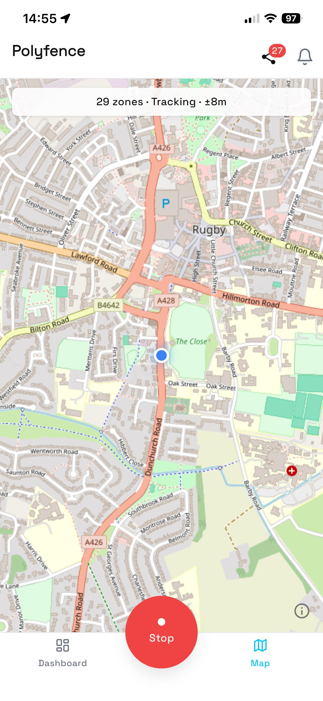
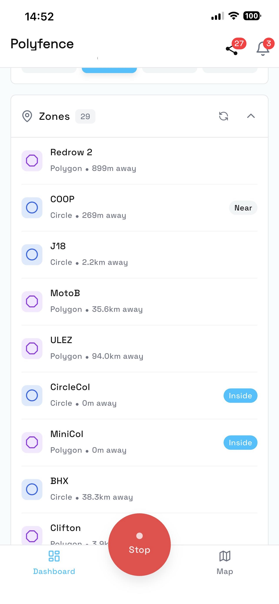
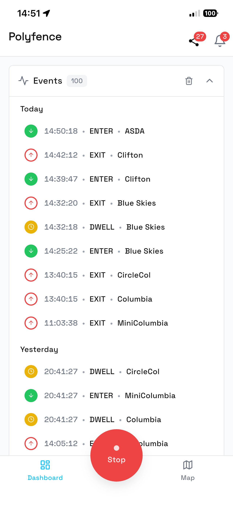
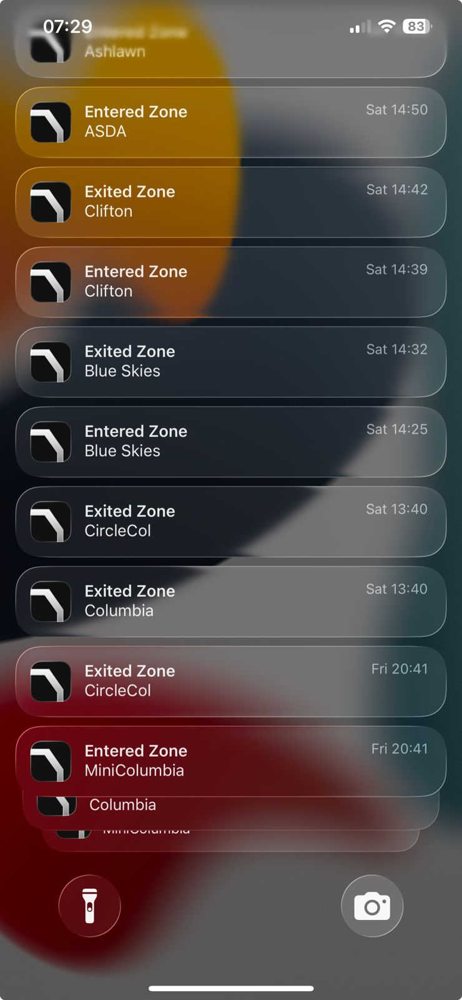
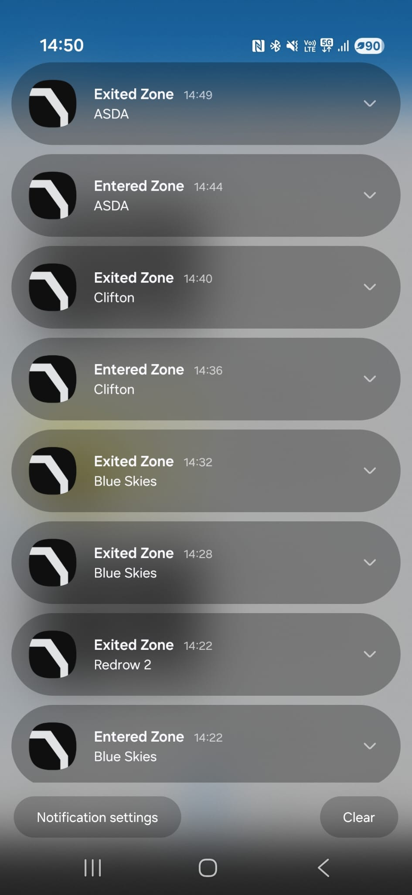
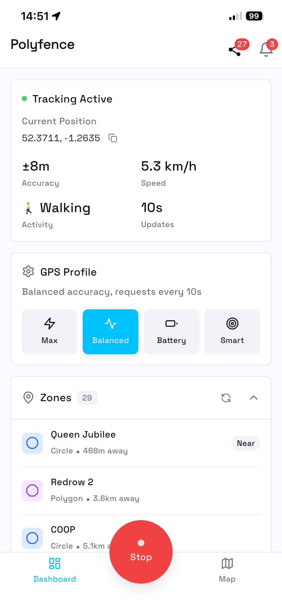

# Polyfence React Native

**The Polyfence geofence layer for React Native.** Define zones once; same zones run on your mobile app, your IoT device, and your server (Polyfence platform). This package is the React Native bridge over polyfence-core (engine source: [github.com/polyfence/polyfence-core](https://github.com/polyfence/polyfence-core)). Privacy-first by default — positions never leave the device; only zone events.

[](https://www.npmjs.com/package/polyfence-react-native)
[](https://github.com/polyfence/polyfence-react-native/actions/workflows/ci.yml)
[](https://opensource.org/licenses/MIT)


<p>
  
  
</p>

The screenshots above are from the [example app](example/) in this repo —
a working iOS + Android React Native app that fetches zones from the
Polyfence SaaS, tracks location, and renders enter / exit / dwell events.
Sign up at [polyfence.io](https://polyfence.io) for a free API key, then
follow [`example/README.md`](example/README.md) to run it locally.

## Who this is for

You're building a React Native app that needs geofencing — delivery, logistics, fitness, healthcare, asset tracking, agritech, fleet, or consumer. You want the math on-device, the zones defined once, and the same definitions reusable on your IoT firmware or server when you grow into those surfaces.

This package is the React Native bridge. The same engine runs on iOS/Android via [polyfence-core](https://github.com/polyfence/polyfence-core), on embedded MCUs via [polyfence-embedded](https://github.com/polyfence/polyfence-embedded), and server-side via the [Polyfence API](https://polyfence.io/api/docs).

## Why Polyfence?

- **Polygon geofencing** — Not just circles. Define zones with arbitrary polygon boundaries (complex city zones, campus outlines, delivery areas).
- **Unlimited zones** — No artificial limits. Monitor hundreds of zones simultaneously with zone clustering for performance.
- **Privacy-first** — All geofencing runs on-device. Zero location data ever leaves the device by default. No cloud dependency.
- **SmartGPS** — Intelligent GPS scheduling based on proximity, movement, activity, and battery state. 40-50% less battery drain than naive polling.
- **Activity recognition** — Automatically detect user activity (walking, driving, stationary) and optimize GPS intervals.
- **Background tracking** — True background operation with foreground service (Android) and location background mode (iOS).
- **TypeScript-first** — Full type definitions. Built for type safety.
- **Dwell detection** — Detect when users stay in zones for a configured duration.

## Where your zones come from

Three storage choices — same plugin API in all cases:

| Approach | Backend | API Key | Best For |
|----------|---------|---------|----------|
| **Hardcode zones in your app** | None | Not needed | Static zones, full control, privacy-first apps |
| **Fetch from your own API** | Your backend | Not needed | Existing infrastructure, custom zone logic |
| **Use the Polyfence dashboard** | polyfence.io | Required | Visual zone editor, analytics dashboard |

Same plugin API in all cases. The Polyfence platform layer (SDK + dashboard + API) is the geofence layer underneath your product, whether you store zones in code or in the dashboard.

---

## Requirements

| Requirement | Version |
|-------------|---------|
| **React Native** | 0.73+ |
| **Node.js** | 18.0+ |
| **Android** | API 24+ (Android 7.0), tested up to API 35 (Android 15) |
| **iOS** | 14.0+ |

## Platform Support

| Feature | Android | iOS |
|---------|---------|-----|
| Circle geofences | Yes | Yes |
| Polygon geofences | Yes | Yes |
| Dwell detection | Yes | Yes |
| Zone clustering | Yes | Yes |
| Scheduled tracking | Yes | Yes |
| Activity recognition | Yes | Yes |
| Background tracking | Yes (foreground service) | Yes ("Always" permission) |
| Battery optimization bypass | Yes | N/A |
| GPS accuracy profiles | Yes | Partial (iOS manages GPS) |

## Installation

```bash
npm install polyfence-react-native
# or
yarn add polyfence-react-native
```

**Native dependency:** Polyfence uses [polyfence-core](https://github.com/polyfence/polyfence-core) for native geofencing engines. It's included automatically — Maven for Android, CocoaPods for iOS. On iOS, run `cd ios && pod install` after adding the dependency.

```bash
cd ios && pod install
```

---

## Platform Setup

### Android — `android/app/src/main/AndroidManifest.xml`

```xml
<uses-permission android:name="android.permission.ACCESS_FINE_LOCATION" />
<uses-permission android:name="android.permission.ACCESS_COARSE_LOCATION" />
<uses-permission android:name="android.permission.ACCESS_BACKGROUND_LOCATION" />
<uses-permission android:name="android.permission.FOREGROUND_SERVICE" />
<uses-permission android:name="android.permission.FOREGROUND_SERVICE_LOCATION" />
<uses-permission android:name="android.permission.WAKE_LOCK" />
<uses-permission android:name="android.permission.REQUEST_IGNORE_BATTERY_OPTIMIZATIONS" />
```

Ensure your `android/app/build.gradle` has the correct minimum SDK version:

```groovy
android {
    defaultConfig {
        minSdkVersion 24 // Required for Polyfence
    }
}
```

**Foreground Service Notification:** Polyfence requires a foreground service notification on Android. The plugin automatically creates the notification channel — no additional setup required. The notification uses low priority and is silent.

### iOS — `ios/[YourApp]/Info.plist`

```xml
<key>NSLocationWhenInUseUsageDescription</key>
<string>This app needs location access to detect when you enter or exit defined zones.</string>

<key>NSLocationAlwaysAndWhenInUseUsageDescription</key>
<string>Background location access is required for continuous zone monitoring.</string>

<key>NSLocationAlwaysUsageDescription</key>
<string>Background location access is required for continuous zone monitoring.</string>

<key>UIBackgroundModes</key>
<array>
  <string>location</string>
</array>
```

**iOS Background Mode in Xcode:**

1. Open `ios/[YourApp].xcworkspace` in Xcode
2. Select the [YourApp] target → **Signing & Capabilities**
3. Click **+ Capability** → add **Background Modes**
4. Check **Location updates**

**iOS Permission Flow:**

iOS requires "Always" location permission for background geofencing:

1. **First Request:** When you call `requestPermissions({ always: true })`, iOS shows a "While in use" permission dialog
2. **Manual Step Required:** The user must manually enable "Always" permission in Settings → Privacy & Security → Location Services → Your App → "Always"
3. **Check Permission Status:**

```typescript
const isEnabled = await Polyfence.instance.isLocationServiceEnabled();
if (!isEnabled) {
  // Guide user to enable location services
}

const granted = await Polyfence.instance.requestPermissions({ always: true });
if (granted) {
  // User granted "While in use" — they still need to enable "Always" in Settings
  // You may want to show a dialog guiding them to Settings
}
```

---

## Quick Start

### Step 1: Import and Initialize

```typescript
import { Polyfence } from 'polyfence-react-native';

await Polyfence.instance.initialize();
```

### Step 2: Request Permissions

```typescript
const hasPermission = await Polyfence.instance.requestPermissions({ always: true });
if (!hasPermission) {
  // Handle permission denied
  return;
}
```

### Step 3: Add Zones

```typescript
// Circle zone
await Polyfence.instance.addZone({
  id: 'office',
  name: 'Office',
  type: 'circle',
  center: { latitude: 37.422, longitude: -122.084 },
  radius: 150,
});

// Polygon zone
await Polyfence.instance.addZone({
  id: 'campus',
  name: 'Campus',
  type: 'polygon',
  polygon: [
    { latitude: 37.422, longitude: -122.084 },
    { latitude: 37.423, longitude: -122.085 },
    { latitude: 37.424, longitude: -122.083 },
  ],
});
```

Zones are automatically persisted across app restarts. No hard limit on zone count (tested with 100+ zones on both platforms). Large polygons (1000+ points) are supported; the plugin uses Douglas-Peucker simplification to optimize complex polygons.

### Step 4: Listen for Events

```typescript
const subscription = Polyfence.instance.onGeofenceEvent((event) => {
  switch (event.type) {
    case 'enter':
      console.log(`Entered: ${event.zoneId}`);
      break;
    case 'exit':
      console.log(`Exited: ${event.zoneId}`);
      break;
    case 'dwell':
      console.log(`Stayed in ${event.zoneId} for ${event.dwellDurationMs}ms`);
      break;
    default:
      break;
  }
});

// Don't forget to unsubscribe in cleanup
subscription.remove();
```

<p align="center">
  
</p>

Events fire whether your app is foregrounded, backgrounded, or the screen is locked. Here's what users see on each platform when zones fire in the background:

<p align="center">
  
  
</p>

### Step 5: Start Tracking

```typescript
await Polyfence.instance.startTracking();
```

### Step 6: Handle Errors (Optional)

```typescript
const errorSubscription = Polyfence.instance.onError((error) => {
  switch (error.type) {
    case 'gpsPermissionDenied':
      // Guide user to settings
      break;
    case 'gpsServiceDisabled':
      // Prompt to enable GPS
      break;
    default:
      console.log(`Error: ${error.message}`);
  }
});
```

---

## API Reference

### Lifecycle Methods

| Method | Returns | Description |
|--------|---------|-------------|
| `initialize(config?)` | `Promise<void>` | Initialize the geofencing engine |
| `startTracking()` | `Promise<void>` | Start background GPS tracking |
| `stopTracking()` | `Promise<void>` | Stop GPS tracking |
| `dispose()` | `Promise<void>` | Clean up resources and stop tracking |
| `removeAllListeners()` | `void` | Remove all event listeners without disposing the engine |

### Zone Management

| Method | Returns | Description |
|--------|---------|-------------|
| `addZone(zone)` | `Promise<void>` | Add a circle or polygon zone |
| `removeZone(zoneId)` | `Promise<void>` | Remove a zone by ID |
| `clearAllZones()` | `Promise<void>` | Remove all zones |
| `getZoneStates()` | `Promise<ZoneState[]>` | Get current INSIDE/OUTSIDE state for all zones |

### Configuration

| Method | Returns | Description |
|--------|---------|-------------|
| `getConfiguration()` | `Promise<PolyfenceConfiguration>` | Get current configuration |
| `updateConfiguration(config)` | `Promise<void>` | Update configuration |
| `resetConfiguration()` | `Promise<void>` | Reset to defaults |
| `setAccuracyProfile(profile)` | `Promise<void>` | Set GPS accuracy profile |

### Permissions & System

| Method | Returns | Description |
|--------|---------|-------------|
| `requestPermissions(options?)` | `Promise<boolean>` | Request location permissions |
| `isLocationServiceEnabled()` | `Promise<boolean>` | Check if location services are enabled |
| `batteryOptimizationStatus()` | `Promise<BatteryOptimizationStatus>` | Check battery optimization status (Android) |
| `requestBatteryOptimizationExemption()` | `Promise<boolean>` | Request battery optimization exemption (Android) |

### Debug & Telemetry

| Method | Returns | Description |
|--------|---------|-------------|
| `debugInfo()` | `Promise<PolyfenceDebugInfo>` | Get debug information (version, status, error history) |
| `getSessionTelemetry()` | `Promise<SessionTelemetry>` | Get session metrics (GPS updates, zone events, battery impact) |
| `errorHistory(options?)` | `Promise<PolyfenceError[]>` | Get recent errors |

### Events

| Method | Callback | Description |
|--------|----------|-------------|
| `onLocationUpdate(callback)` | `(location: PolyfenceLocation) => void` | Raw GPS location updates |
| `onGeofenceEvent(callback)` | `(event: GeofenceEvent) => void` | Zone enter/exit/dwell events |
| `onError(callback)` | `(error: PolyfenceError) => void` | Error events |
| `onPerformance(callback)` | `(payload: PerformanceEventPayload) => void` | Performance status updates (untyped payload) |
| `onHealthScore(callback)` | `(event: HealthScoreEvent) => void` | Periodic health score (0-100) with top issue |
| `onZoneEnter(callback)` | `(event: GeofenceEvent) => void` | Zone enter events only |
| `onZoneExit(callback)` | `(event: GeofenceEvent) => void` | Zone exit events only |

All event methods return a `Subscription` object with a `remove()` method to unsubscribe.

---

## Events

### Geofence Events

```typescript
Polyfence.instance.onGeofenceEvent((event) => {
  console.log({
    zoneId: event.zoneId,
    zoneName: event.zoneName,
    type: event.type, // 'enter' | 'exit' | 'dwell' | 'recoveryEnter' | 'recoveryExit'
    location: event.location,
    timestamp: event.timestamp,
    confidence: event.confidence, // 0-1
    dwellDurationMs: event.dwellDurationMs,
  });
});
```

### Location Events

```typescript
Polyfence.instance.onLocationUpdate((location) => {
  console.log({
    latitude: location.latitude,
    longitude: location.longitude,
    accuracy: location.accuracy, // meters
    altitude: location.altitude,
    speed: location.speed, // m/s
    bearing: location.bearing,
    timestamp: location.timestamp,
  });
});
```

### Error Events

```typescript
Polyfence.instance.onError((error) => {
  console.log({
    type: error.type, // 'gpsPermissionDenied' | 'gpsServiceDisabled' | ...
    message: error.message,
    context: error.context,
    correlationId: error.correlationId,
    timestamp: error.timestamp,
  });
});
```

### Performance Events

The performance payload is untyped (`PerformanceEventPayload = Record<string, unknown>`) — the fields below are illustrative and must be narrowed at runtime before use.

```typescript
Polyfence.instance.onPerformance((payload) => {
  console.log({
    isTracking: payload.isTracking,
    activeZoneCount: payload.activeZoneCount,
    currentAccuracyProfile: payload.currentAccuracyProfile,
    currentIntervalMs: payload.currentIntervalMs,
    batteryLevel: payload.batteryLevel,
  });
});
```

---

## Configuration

### GPS Accuracy Profiles

```typescript
// Maximum accuracy (highest battery usage)
await Polyfence.instance.setAccuracyProfile('maxAccuracy');

// Balanced accuracy/battery (DEFAULT - recommended)
await Polyfence.instance.setAccuracyProfile('balanced');

// Battery-optimized for background monitoring
await Polyfence.instance.setAccuracyProfile('batteryOptimal');

// Intelligent auto-adjustment
await Polyfence.instance.setAccuracyProfile('adaptive');
```

| Profile | Update Interval | Battery Impact | Use Case |
|---------|-----------------|----------------|----------|
| **maxAccuracy** | 5 seconds | High | Delivery, navigation, fleet tracking |
| **balanced** | 10 seconds | Medium | Most location-aware apps (DEFAULT) |
| **batteryOptimal** | 30 seconds | Low | Background monitoring, casual use |
| **adaptive** | Dynamic | Variable | Apps with varying accuracy needs |

<p align="center">
  
</p>

### Dwell Detection

```typescript
await Polyfence.instance.updateConfiguration({
  dwellDetectionEnabled: true,
  dwellDefaultThresholdMs: 5 * 60 * 1000, // 5 minutes
});

Polyfence.instance.onGeofenceEvent((event) => {
  if (event.type === 'dwell') {
    console.log(`User confirmed in ${event.zoneId}`);
  }
});
```

### Zone Clustering

For apps with 100+ zones, clustering improves performance:

```typescript
await Polyfence.instance.updateConfiguration({
  clusteringEnabled: true,
  clusterRadiusM: 5000, // Check zones within 5km
});
```

### Scheduled Tracking

Track only during specific time windows:

```typescript
await Polyfence.instance.updateConfiguration({
  scheduleSettings: {
    enabled: true,
    timeWindows: [
      {
        startHour: 9,
        startMinute: 0,
        endHour: 17,
        endMinute: 0,
        daysOfWeek: [1, 2, 3, 4, 5], // Monday-Friday
      },
    ],
  },
});
```

### Activity Recognition

Automatically detect activity and optimize GPS:

```typescript
await Polyfence.instance.updateConfiguration({
  activityRecognitionEnabled: true,
  activityRecognitionIntervalMs: 10000, // 10 second detection interval
});
```

**Additional Permissions Required (Android):**

```xml
<uses-permission android:name="android.permission.ACTIVITY_RECOGNITION" />
```

---

## Expo Support

Polyfence requires native modules and cannot run on Expo Go. Use `expo-dev-client` for a custom development build:

```bash
npx create-expo-app MyApp
cd MyApp
npx expo install expo-dev-client
npx expo prebuild --clean
npm install polyfence-react-native
npx expo run:ios    # or run:android
```

See [Expo Custom Development Client docs](https://docs.expo.dev/develop/development-builds/introduction/) for more details.

---

## Privacy

**Zero PII about your end users.** The only personal information Polyfence holds is the *developer's* account info (email, billing) — same as any paid SaaS.

Different defaults for different data classes:

- **Positions** — opt-in. Never persisted on Polyfence servers by default. If you turn retention on, positions are stored in your tenant — never names, phones, emails, or health data.
- **Anonymous telemetry** — opt-out, one line disables (see below). Never coordinates, never identifiers, never PII — only aggregates (platform, plugin version, accuracy averages, error counts).
- **Zone events** — always on. They're the value we deliver, not surveillance.

This is the deliberate posture, not an inconsistency. See [PRIVACY.md](PRIVACY.md) for the full breakdown.

### Disable telemetry (one line)

```typescript
await Polyfence.instance.initialize(undefined, { disableTelemetry: true });
```

### Architecture Guarantees

- **On-device geofencing**: All zone detection runs locally using native GPS APIs
- **Local persistence**: Zones stored in SharedPreferences (Android) / UserDefaults (iOS)
- **No tracking**: No user behavior tracking, no cross-app tracking
- **GDPR/CCPA-friendly**: Anonymous aggregates only by default, one-line disable for telemetry, opt-in for position retention

---

## Common Gotchas

### Stream Subscription Management

Always remove event subscriptions in cleanup to prevent memory leaks:

```typescript
useEffect(() => {
  const subscription = Polyfence.instance.onGeofenceEvent((event) => {
    // handle event
  });

  return () => {
    subscription.remove();
  };
}, []);
```

### Zone Persistence

Zones are automatically persisted across app restarts — no manual persistence needed. When loading zones from an external source, consider delta-based sync to avoid re-registering all zones.

### OEM Battery Restrictions (Android)

Some Android manufacturers aggressively kill background services. If tracking stops, the user likely needs to whitelist your app. See [dontkillmyapp.com](https://dontkillmyapp.com) for device-specific instructions.

### NativeModule Not Found

If you see "NativeModule not found" error:

1. Rebuild the app so autolinking picks up the module (RN 0.60+ autolinks — `react-native link` is obsolete); on iOS run `cd ios && pod install` then rebuild
2. For Expo: Use `expo-dev-client` (not Expo Go)
3. Clear build caches: `rm -rf node_modules && npm install && cd ios && rm -rf Pods && pod install`

### Pod Install Fails (iOS)

```bash
cd ios
rm -rf Pods Podfile.lock
pod repo update
pod install
```

### Android Build Fails

Ensure minimum SDK is 24+:

```groovy
android {
    defaultConfig {
        minSdkVersion 24
    }
}
```

---

## Known Differences from Flutter

The following Flutter APIs are intentionally deferred from v1.0.11 of this package:

- `enableIntelligentOptimization()`, `enableProximityOptimization()`, `enableMovementOptimization()` — ML-powered optimization APIs. These will be added when the intelligence layer is integrated (planned for a future release).
- `zones` getter — Use `getZoneStates()` to query current zone state.
- `currentConfiguration` getter — Use `getConfiguration()` instead.
- `statusStream` — Use `onPerformance()` event listener for runtime status updates.
- `requestPermissions` on Android does not show a system dialog. Use `react-native-permissions` to trigger the dialog, then call `requestPermissions()` to verify the result.

These gaps will be addressed in subsequent releases.

---

## Troubleshooting

### Debugging

**Android** — Filter logcat:

```bash
adb logcat | grep -E "LocationTracker|GeofenceEngine|Polyfence"
```

**iOS** — Filter Xcode console:

```
LocationTracker GeofenceEngine Polyfence
```

**Programmatic debugging** — Use the debug API:

```typescript
const debug = await Polyfence.instance.debugInfo();
console.log('Last fix:', debug.lastLocationTimestamp);
console.log('Active zones:', debug.activeZones);
console.log('Tracking:', debug.isTracking);
```

### Reporting Issues

When opening a GitHub issue, include:

1. Output of `Polyfence.instance.debugInfo()`
2. Device manufacturer and OS version (e.g., Samsung Galaxy S24, Android 14)
3. Whether battery optimization is disabled
4. Logcat/Xcode console output
5. Minimal code sample to reproduce

---

## Contributing

Contributions are welcome. See [CONTRIBUTING.md](CONTRIBUTING.md) for development setup, code style, and PR guidelines.

## Support

- **Plugin Issues**: [GitHub Issues](https://github.com/polyfence/polyfence-react-native/issues)
- **Questions & Discussions**: Open an issue with the `question` label
- **Security Issues**: See [SECURITY.md](SECURITY.md)
- **Commercial Support**: [polyfence.io](https://polyfence.io)

## License

MIT — see [LICENSE](LICENSE)

Copyright (c) 2026 Polyfence
